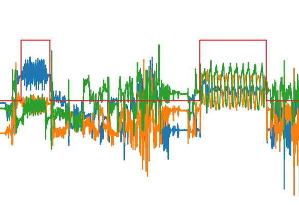

# uLift dataset loader

* This document is out-dated. Most information will remain correct, however, some needs to be updated.

# Classes
## SensorData
- Basic class of the sensor data.
- WorkoutData, RestData, WholeData will be inherent this class.
- #### Basic variables
     + file_name : file name
     + root : root of the file
     + csv_path : root + file_name
     + raw_data : raw data as the original of csv file
     + sensor_data : 3 axis of accelrerometer sensor. "accX", "accY", "accZ"
     + total\_time\_sec : total capture time of the csv file in seconds.
     + sampling_rate : sampling rate of the sensor.
     + info_path : the file path that contains its annotation.

- #### Information from the anotation.
     + user_name : name of the user.
     + user\_nick\_name : nickname of the user.
     + user\_workout\_experience : experience of the user that involves a fitness.
     + user_gender : gender of the user.
     + user\_birth\_year : birth year of the user.
     + user_weight : weight of the user. This field can be <B>empty</B>.
     + user_height : height of the user. This field can be <B>empty</B>.
     + info\_not\_processed : the annotations that might not be processed as something else was written in the annoation file.

## WorkoutData
- Inherit SensorData class.

- ## Variables
    + workout\_class\_number : a number of the workout class. Each of the workout has to have a unique number.
    + workout\_class\_name : a name of the workout.
    + repetition_number : a number of repetition that contains in the sensor data.

## RestData
- Inherit SensorData class.

## WholeData
- Inherit SensorData class.
- This class will contain workout and rest data of multiple sets including workout state information.  

- ## Variables
    + workout\_class\_info : it contains workout class numbers and names which are array of two dimensions [number, name].
    + workout_state : state of the workout. Its length will be the length of the sensor data. 0 is non-workout and 1 is workout state.
    + sensor_data : sensor data of accelerometer.

## DataSession
- This contains every session of workout.

- ## Variables
    + rest_data : rest data array that contains RestData class.
    + workout_data : workout data array that contains WorkoutData class.
    + whole_data : whole data of WholeData class.

## DataSetLoader
- This class will load every workout session data from the root path and store them to <B>DataSession</B> class.

- <B>Usage</B>
    + DatasetLoader(path="dataset/", training_idx=[0])
    + <B>training_idx</B> should contain the index of the training data.

- ## Variables
    + root_path : root path of the datasets
    + training_dataset : array of DataSession used for training purpose.
    + testing_dataset : array of DataSession used for testing purpose.

